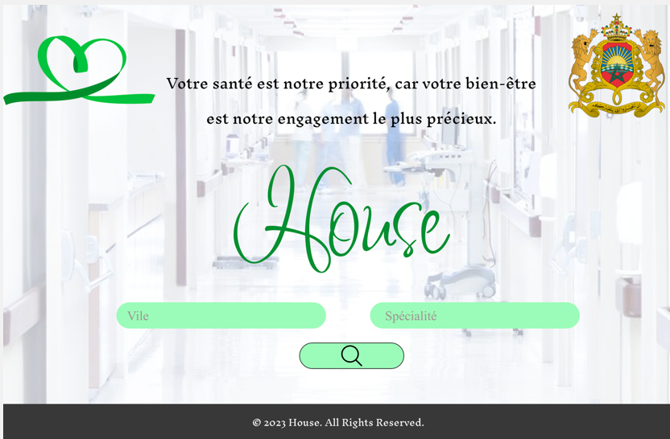
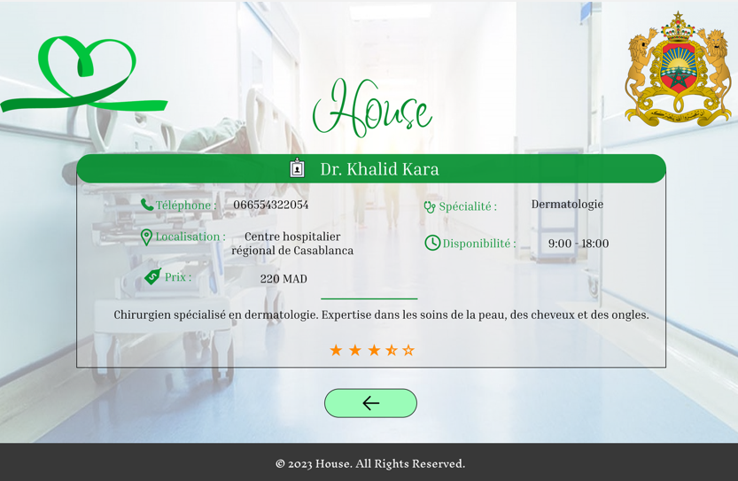

# House

## Overview

For foreign travelers, the excitement of discovering a new country can sometimes be marred by unexpected challenges, especially when it comes to urgent medical needs. Imagine being in the euphoric setting of the 2030 World Cup in Morocco, where every moment should be a memorable celebration. However, in the event of a pressing health issue, finding a suitable doctor quickly becomes essential to ensure this experience remains unforgettable and doesn't turn into a nightmare. While it's easy to find restaurants, hotels, or other services, the quest for adequate and prompt medical assistance is often a significant challenge for foreign travelers. It is with this in mind that our project, an innovative website, presents itself as a crucial solution. Our platform aims to facilitate the search and location of qualified healthcare professionals, according to the city and required specialty, thus offering peace of mind to foreign visitors during their stay for the 2030 World Cup in Morocco.

## Main Features

### For Foreign Travelers

**Primary Users**: Travelers seeking urgent medical assistance.

**Actions**:
- Search for healthcare professionals by city and specialty
- View detailed profiles of healthcare professionals
- Access contact information and location details
- Get prompt and adequate medical assistance

### For Healthcare Professionals

**Primary Users**: Doctors and healthcare providers offering services to travelers.

**Actions**:
- Create and manage profiles with detailed information such as specialty, location, and contact information
- Update availability and service details

### For Platform Administrators

**Management Users**: Administrators who monitor and manage the House platform.

**Actions**:
- Verify healthcare professional profiles to ensure quality and accuracy
- Manage user accounts and resolve technical issues

### For Visitors

**Visitors**: People browsing the platform without registering.

**Actions**:
- Limited browsing of healthcare professional profiles
- Restricted access to features reserved for registered users

## Features

- **Healthcare Professional Listings**: Comprehensive listings of available healthcare professionals tailored to foreign travelers' needs.
- **Filtering Options**: Advanced filtering by city and specialty to find the most suitable healthcare providers.
- **Detailed Profiles**: In-depth information about healthcare professionals, including specialty, location, and contact details.
- **User Management**: Easy management of profiles and user interactions by healthcare professionals and administrators.
- **Admin Tools**: Robust tools for administrators to monitor platform activity and address issues.

## Usage

1. **For Travelers**:
   - Search for healthcare professionals by using the filter options.
   - View detailed information about each professional.
   - Access contact and location details for prompt assistance.

2. **For Healthcare Professionals**:
   - Create and manage profiles with all necessary details.
   - Update availability and service details as needed.

3. **For Administrators**:
   - Monitor and verify new profiles.
   - Manage user accounts and resolve technical issues.

4. **For Visitors**:
   - Browse available healthcare professional profiles with limited access.
   - Register to unlock full functionality.

